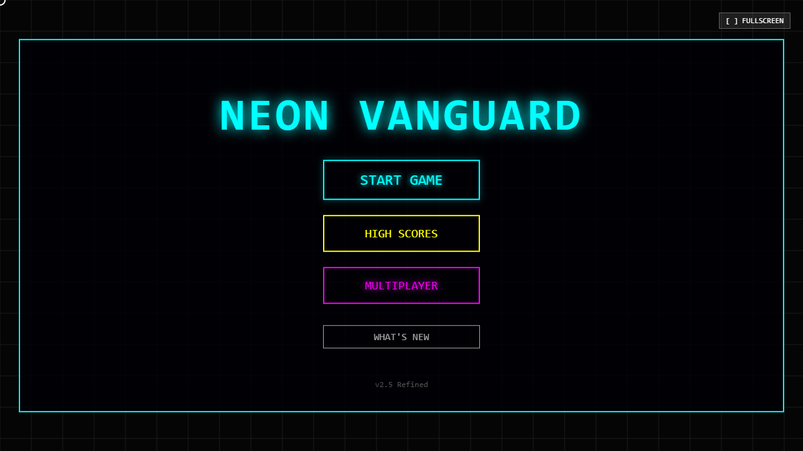
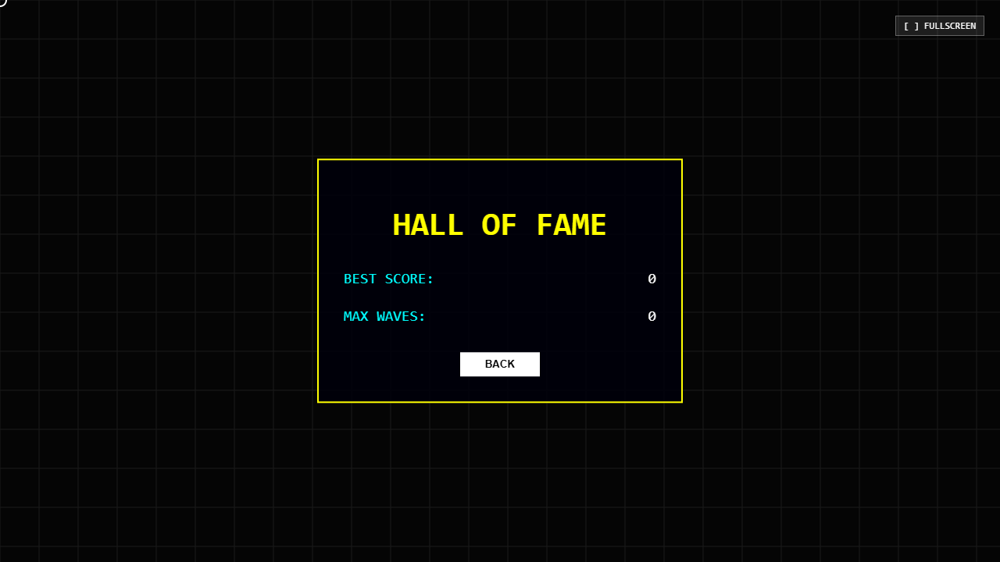

<div align="center">
  
  <h1>Neon Vanguard</h1>
  <p>An action-packed, web-based multiplayer arcade game with dynamic neon visuals, wave-based survival, and cross-platform mobile accessibility!</p>
  <h3>🎮 <a href="https://nguard.netlify.app/">Play it Live Here!</a></h3>
</div>

---

## 🚀 Overview

**Neon Vanguard** is a highly interactive, HTML5 Canvas-powered game utilizing modern web technologies. Face off against endless waves of enemies, collect resources, upgrade your arsenal, and dive into local/network multiplayer—all seamlessly running in your browser!

### ✨ Key Features

- **🎮 Universal Controls:** Play on your desktop with Keyboard/Mouse or seamlessly on mobile with a responsive on-screen touch HUD.
- **👥 Multiple Characters:** Choose between different unique characters, each bringing their own distinct gameplay style and visual flair.
- **🌐 Network Multiplayer:** Powered by `PeerJS`, connect and play with friends online.
- **🌊 Dynamic Wave Survival:** Survive escalating waves of unique enemies via the robust `WaveManager` system.
- **🛒 Progression & Upgrades:** Access the in-game `ShopSystem` to purchase upgrades and equip yourself in the Arsenal.
- **✨ Stunning Visuals:** Custom-built `ParticleSystem` and `EntropySystem` for immersive, flashy neon graphics and effects.
- **🛠️ Built for Performance:** Leveraging a pure HTML5 Canvas approach optimized with modern TypeScript and bundled via Vite.

---

## 📸 In-Game Screenshots

<div align="center">
  
  
</div>

---

## 📂 Project Structure

```text
📁 src
 ├── ⚙️ core/
 │    ├── Game.ts         # Core game loop and rendering engine
 │    └── Input.ts        # Desktop & Mobile input handling
 ├── 👾 entities/
 │    ├── Player.ts       # Player logic and mechanics
 │    ├── Enemy.ts        # Enemy behaviors and types
 │    ├── Projectile.ts   # Bullet tracking and collision
 │    └── Entity.ts       # Base entity blueprint
 └── 🕹️ systems/
      ├── MenuSystem.ts     # Main menus and UI
      ├── NetworkSystem.ts  # PeerJS networking logic
      ├── ShopSystem.ts     # In-game currency and upgrades
      ├── WaveManager.ts    # Wave progression and spawning
      ├── ParticleSystem.ts # VFX and explosions
      └── EntropySystem.ts  # Game difficulty/chaos scaling
```

---

## 🛠️ Technologies Used

- **[TypeScript](https://www.typescriptlang.org/)**: Strongly typed, robust core logic.
- **[Vite](https://vitejs.dev/)**: Lightning-fast local development and production building.
- **[HTML5 Canvas API](https://developer.mozilla.org/en-US/docs/Web/API/Canvas_API)**: Raw, high-performance rendering.
- **[PeerJS](https://peerjs.com/)**: Peer-to-peer network connections for multiplayer gameplay.

---

## 🏎️ Getting Started

Follow these steps to run the game locally:

### Prerequisites

Ensure you have [Node.js](https://nodejs.org/) (v16 or higher) installed.

### 1. Clone & Install
```bash
# Navigate to the project directory
cd "demo game"

# Install dependencies
npm install
```

### 2. Run Local Development Server
```bash
# Start the Vite development server
npm run dev
```
Open your browser and navigate to `http://localhost:5173`. 
*(You can also use the local IP displayed in the terminal to play on your mobile device on the same network!)*

### 3. Build for Production
```bash
# Compile TypeScript and bundle for production
npm run build

# Preview the production build
npm run preview
```

---

## 🤝 Contributing

This is a continuous work-in-progress demo game. Contributions, ideas, and feedback are always welcome to help improve Neon Vanguard!

1. Fork the Project
2. Create your Feature Branch (`git checkout -b feature/AmazingFeature`)
3. Commit your Changes (`git commit -m 'Add some AmazingFeature'`)
4. Push to the Branch (`git push origin feature/AmazingFeature`)
5. Open a Pull Request

---

<div align="center">
  <p>Built with ❤️ using TypeScript & Vite.</p>
</div>
